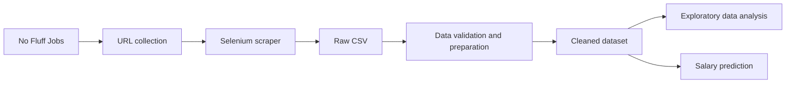

# Job Market Intelligence

<p align="center">
  
  
  
  
  
  
  
</p>

End-to-end analysis of the Polish IT job market based on **3,360 job offers**
collected from No Fluff Jobs. The project covers data collection, validation,
cleaning, exploratory analysis and machine-learning-based salary prediction.

Unlike projects built from a ready-made dataset, this repository includes the
complete path from changing web pages and inconsistent source values to
reproducible analytical results.

## 🚀 Project highlights

- Custom Selenium scraper covering 25 job categories.
- Incremental collection with checkpoints, logging and error handling.
- Detection of expired, blocked and otherwise invalid offer pages.
- Salary normalization across PLN, EUR and USD and hourly, daily, monthly and
  yearly periods.
- Data-quality flags that preserve questionable source records while excluding
  them from inappropriate comparisons.
- Exploratory analysis of experience, salaries, companies, locations,
  workplace models, contracts and technologies.
- Comparison of five regression algorithms using five-fold cross-validation.
- Feature engineering from required technologies and TF-IDF job-title terms.
- Tuned XGBoost model with error analysis and permutation importance.
- **114 automated tests** covering parsers, storage, refresh logic and scraper
  orchestration without requiring network access.

## 🔄 Analytical workflow



The notebooks should be read in this order:

1. [`data_collection.ipynb`](notebooks/data_collection.ipynb) — collects URLs,
   scrapes offers and validates the raw dataset.
2. [`data_preparation.ipynb`](notebooks/data_preparation.ipynb) — cleans and
   standardizes the collected records.
3. [`eda.ipynb`](notebooks/eda.ipynb) — examines the structure of the market and
   answers the main analytical questions.
4. [`Modeling.ipynb`](notebooks/Modeling.ipynb) — builds and evaluates monthly
   salary regression models.

## 📊 Key findings

- Senior and Mid positions jointly represent **90.6%** of offers, while Junior
  positions account for only **4.2%**.
- Hybrid work is the most common workplace model at **56.0%**, followed by
  Remote at **35.1%**.
- B2B is the only reported contract option in **67.1%** of offers; contract
  information is missing for **22.9%**.
- Recruitment activity is concentrated: the 10 most active companies account
  for **37.2%** of offers.
- The median standardized monthly salary midpoint is approximately
  **PLN 24,360**.
- Median salary rises from **PLN 13,225** for Junior roles to **PLN 30,240**
  for Expert roles.
- Warsaw and Kraków dominate city-based recruitment. Kraków has the highest
  median salary among sufficiently represented cities at **PLN 26,250**.
- Python, SQL and Java are the most frequently identified technologies.
- Architecture and ERP are among the highest-paying sufficiently represented
  categories, including after controlling the comparison for Senior roles.

The dataset is a market snapshot collected between **24 and 26 August 2026**.
Detailed definitions, denominators and caveats are available in the EDA
notebook.

## 🤖 Machine learning

### Objective

Predict the midpoint of an advertised monthly salary range in PLN using job
attributes available in the offer. Only **2,339 offers** passing the salary
quality filter are used for regression.

The initial structured features include:

- experience level and minimum required years,
- job category,
- contract type,
- workplace model,
- job location,
- company-size segment.

The final feature set additionally contains binary indicators for 20 frequent
technologies and TF-IDF features extracted from job titles. Salary source
columns are excluded to prevent target leakage.

### Model comparison

| Model | CV MAE (PLN) | CV RMSE (PLN) | CV R² |
|---|---:|---:|---:|
| XGBoost | 4,032 | 5,404 | 0.44 |
| Random Forest | 4,238 | 5,653 | 0.39 |
| Linear Regression | 4,337 | 5,807 | 0.36 |
| KNN Regression | 4,613 | 6,133 | 0.28 |
| Decision Tree | 4,641 | 6,166 | 0.28 |

Adding skill and title features raised mean cross-validated R² to **0.47**.
Randomized hyperparameter search selected the final XGBoost configuration.

### Final held-out test result

| MAE | RMSE | R² | MAE / median test salary |
|---:|---:|---:|---:|
| PLN 3,941 | PLN 5,548 | 0.47 | 16.0% |

The model captures a meaningful part of salary variation but systematically
regresses toward the middle of the distribution: unusually low salaries tend
to be overestimated and unusually high salaries tend to be underestimated.
This limitation is investigated rather than hidden or removed.

## 🗂️ Repository structure

```text
job_market_intelligence/
├── notebooks/
│   ├── data_collection.ipynb
│   ├── data_preparation.ipynb
│   ├── eda.ipynb
│   └── Modeling.ipynb
├── src/nfj/
│   ├── pipeline.py
│   ├── job_scraper.py
│   ├── refresh.py
│   ├── storage.py
│   ├── urls.py
│   ├── company_parser.py
│   ├── experience_parser.py
│   ├── job_details_parser.py
│   ├── location_parser.py
│   ├── salary_parser.py
│   ├── section_parser.py
│   └── workplace_parser.py
├── tests/
├── data/
│   ├── raw/          # generated locally, excluded from Git
│   └── processed/    # generated locally, excluded from Git
├── requirements.txt
└── README.md
```

`parsers.py` and `scraper.py` are small compatibility facades preserving the
original public imports after the implementation was divided into focused
modules.

## ⚙️ Installation

Python 3.10 or newer is recommended.

```bash
git clone https://github.com/MateuszWojno/job_market_intelligence.git
cd job_market_intelligence

python -m venv .venv
```

Activate the environment:

```bash
# Windows PowerShell
.venv\Scripts\Activate.ps1

# macOS / Linux
source .venv/bin/activate
```

Install dependencies:

```bash
python -m pip install --upgrade pip
pip install -r requirements.txt
```

## ▶️ Usage

Start JupyterLab from the repository root:

```bash
jupyter lab
```

The data files are intentionally excluded from version control. To reproduce
the project from source:

1. Open `notebooks/data_collection.ipynb`.
2. Set the relevant execution flag to `True`:
   - `RUN_URL_COLLECTION`,
   - `RUN_SCRAPING`,
   - `RUN_SALARY_PERIOD_REFRESH`,
   - `RUN_SELECTED_REFRESH`.
3. Run only the collection operations that are required. Network operations
   are disabled by default.
4. Run `data_preparation.ipynb` to create
   `data/processed/nofluff_it_jobs_clean.csv`.
5. Run `eda.ipynb` and `Modeling.ipynb`.

The scraper requires Chrome or another Selenium-compatible local browser.
Collection should be performed responsibly and with an appropriate delay.

## ✅ Tests

All unit tests run locally and do not access the job portal:

```bash
pytest -q
```

Current result:

```text
114 passed
```

The suite covers salary, experience, workplace, location, company and section
parsers as well as storage, refresh operations, driver lifecycle and pipeline
error handling.

## 🧹 Data-quality approach

- Raw source values are retained unless a deterministic correction is
  available.
- Salary normalization and salary analysis use separate eligibility flags.
- Thirteen implausible normalized salary observations remain in the cleaned
  dataset but are excluded from salary comparisons and modeling.
- Expired offers and invalid pages are detected during collection and
  validation.
- Duplicate job URLs and identifiers are checked before analysis.
- Currency conversion uses documented fixed NBP rates to preserve
  reproducibility.

## ⚠️ Limitations

- The data comes from one portal and a short collection period.
- The dataset is cross-sectional and cannot describe changes over time.
- Salary disclosure is not random, so salary modeling may be affected by
  selection bias.
- B2B and employment-contract amounts are not economically equivalent because
  taxation, benefits and paid leave differ.
- Employer-provided categories and experience labels can be incomplete or
  inconsistent with job titles.
- The salary model identifies associations, not causal relationships, and is
  not an estimate of an individual candidate's market value.

## 🛣️ Possible extensions

- Salary-transparency classification using all collected offers.
- Time-series collection and analysis of changing market demand.
- SQL analytical layer and a Power BI or Tableau dashboard.
- Automated test execution with GitHub Actions.

## 👤 Author

**Mateusz Wojno**

[GitHub](https://github.com/MateuszWojno)
